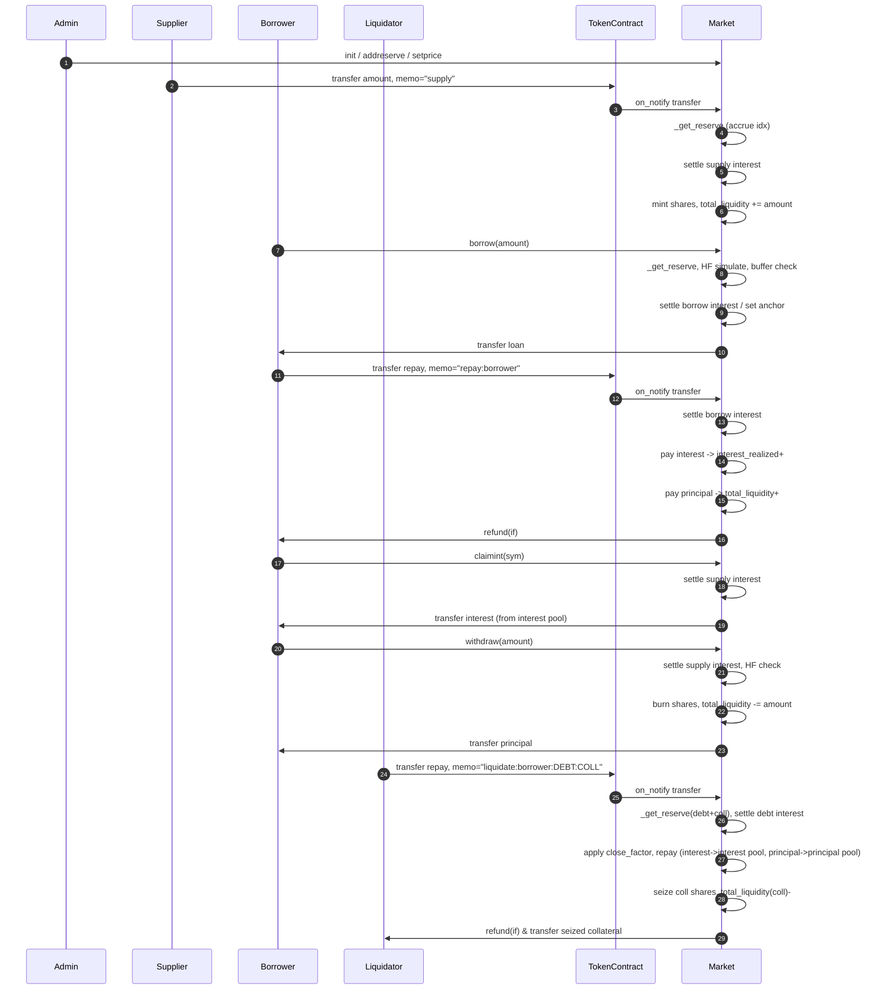

# Tyche Market 逻辑梳理（现行实现）

> 目标：给出可推导、可复用的协议逻辑，覆盖状态定义 → 指数推进 → 核心动作（supply / borrow / repay / withdraw / claim / liquidate）→ HF 校验 → 关键不变量，并附全生命周期时序。

---

## 0. 名词速览
- **本金池（principal pool）**：`total_liquidity` + `total_supply_shares`，只承载本金与归还的本金。
- **利息池（interest pool）**：`interest_realized - interest_claimed`，仅存已收利息，独立于本金池。
- **借款指数**：`borrow_index {id, index, borrow_rate_bp, last_updated}`；累计本金倍率。
- **存款分发指数**：`supply_index {id, reward_per_share, indexed_available, last_updated}`；按利息池增量均摊。
- **HF**：同时要求 `collateral_value ≥ debt_value`（清算线）且 `debt_value ≤ max_borrowable_value`（max_ltv 线）。

---

## 1. 核心状态
### Global
`admin, paused, price_ttl_sec, close_factor_bp, emergency_mode, emergency_bonus_bp, max_emergency_bonus_bp`

### Reserve（多表，scope=contract）
- 身份：`sym_code, token_contract`
- 本金池：`total_liquidity, total_supply_shares`
- 借款应计：`total_borrow_scaled, total_accrued_interest, total_debt(derived)`
- 利息池：`interest_realized, interest_claimed`
- 指数：`borrow_index, supply_index`
- 风控/利率参数：`max_ltv, liquidation_threshold, liquidation_bonus, reserve_factor, u_opt, r0, r_opt, r_max, max_rate_step_bp`
- 其他：`paused`

### Position（scope=owner）
`sym_code, supply_shares, borrow{scaled, accrued_interest, last_borrow_index, id}, supply_interest{pending, claimed, last_reward_per_share, id}, collateral`

---

## 2. 指数推进（以 ctx.now 为唯一时间锚点）
`_get_reserve`（每个 action 首次触碰时执行，缓存快照）：
1) `_accrue_borrow_index`：用旧利率结算 [last, now) 借款利息，增长 `index`、`id`，累加 `total_accrued_interest`。  
2) `_update_borrow_rate`：按当前利用率平滑出下一期利率（受 `max_rate_step_bp`/r0/r_max 保护）。  
3) `_accrue_supply_index`：只分发 `(interest_realized - interest_claimed) - indexed_available` 的增量到 `reward_per_share`，并推进 `id`、`indexed_available`。  
> 不落盘，直到 `_flush_reserve`。

---

## 3. 核心动作（顺序即实际代码路径）
### addreserve（admin）
- 初始化池：本金/利息/指数均为零，借款利率锚定 r0。

### supply（transfer memo="supply"）
1) 取 ctx.now，推进 reserve 指数。  
2) 校验 token 合约、未暂停。  
3) 获取/创建 position，沿用 supply_index 锚点。  
4) `_settle_supply_interest`：按 `delta reward_per_share` 记入 `pending_interest`。  
5) 计算 `share_delta = _supply_shares_from_amount`，累加到用户 & `total_supply_shares`，本金池现金 `total_liquidity += amount`。  
> 不触碰利息池。

### setcollat
- 检查 supply_shares>0、资产可抵押；模拟 HF 后写入 collateral 标志。

### borrow
1) 校验价格存在且 fresh。  
2) 推进 reserve 指数。  
3) HF 模拟：增加 `borrow_scaled_delta`，要求同时满足清算线与 max_ltv。  
4) 可用流动性：本金池扣动态 buffer。  
5) 创建/加载 position；如已有借款先结息，否则建立锚点。  
6) 增加 `borrow_scaled` 与 `total_borrow_scaled`，本金池现金 `total_liquidity -= amount`。  
7) 刷新借款利率；flush 落盘；转出借款。

### repay（transfer memo="repay:borrower"）
1) 推进 reserve 指数。  
2) `_repay_by_snapshot`（先结息）：  
   - 先还利息：`accrued_interest ↓`，`total_accrued_interest ↓`，利息 **只进利息池** `interest_realized += paid_interest`。  
   - 后还本金：`borrow_scaled ↓`，`total_borrow_scaled ↓`，本金池现金 `total_liquidity += paid_principal`。  
3) 刷新利率，flush，退回多余款（如有）。

### withdraw
1) 推进 reserve 指数；结算存款利息。  
2) 计算 `max_withdrawable`（按份额折算）与可用流动性（本金池 buffer）。  
3) 如为抵押资产，模拟 HF（扣 shares）。  
4) 扣 `supply_shares`、`total_supply_shares`，本金池现金 `total_liquidity -= amount`。  
5) 为防利息双计：按赎回份额占比同步将 `pending_interest` 转为 `claimed_interest`，并提升 `interest_claimed`、回退 `supply_index.indexed_available`。  
6) 转出提现。

### claimint
1) 结算存款利息。  
2) `claim_amt = min(pending, interest_realized - interest_claimed)`；只从利息池出账，不动本金池。  
3) 调整 `pending -> claimed`、`interest_claimed += claim_amt`、`supply_index.indexed_available -= claim_amt`。  
4) 转出利息。

### liquidate（transfer memo="liquidate:borrower:DEBT:COLL"）
1) 推进 debt/coll 两个 reserve；校验债务 token 合约、抵押标志为 true 且有 shares。  
2) 债务侧结息一次并计入池级应计。  
3) `debt_before = principal + accrued`，`actual = min(repay_amount, debt_before, close_factor*debt_before)`。  
4) 偿还（利息→利息池，本金→本金池），得到 `paid` 与 `refund`。  
5) 将 `paid` 计价为 USDT，加上 bonus（应急模式可叠加上限），折算成抵押资产数量；按份额 ceil 扣 `supply_shares`、`total_supply_shares`，本金池现金 `total_liquidity -= seize_asset`。  
6) 刷新借款利率；flush 两池；退款（如有）；把抵押资产转给清算人。

---

## 4. 估值与 HF
- `_compute_valuation`：使用缓存的 reserve 快照 + fresh price；债务按本金+accrued 利息；抵押按 `supply_shares` → amount → price，并分别乘 `liquidation_threshold` / `max_ltv` 得到 `collateral_value` 与 `max_borrowable_value`。  
- `_check_health_factor`：要求 `collateral_value >= debt_value` 且 `debt_value <= max_borrowable_value`。

---

## 5. 关键不变量
- 利息池与本金池物理隔离：利息不提升 share 价格，claim 只动利息池。
- 价格必须 fresh（TTL，紧急模式翻倍），USDT 报价；USDT 自定价为 1。
- 借款/清算 token 合约必须匹配 reserve.token_contract，清算只作用于已标记 collateral 的仓位。
- close factor 限制单次可偿还比例；bonus 有上限（应急模式加宽）。
- share 赎回会同步冲减 `pending_interest`，防止利息被 share 抢先兑付后再 claim。

---

## 6. 全生命周期时序（mermaid 示意）

---

## 7. 应急模式
- 价格 TTL 翻倍；清算奖励 `bonus_bp` 提升但 capped by `max_emergency_bonus_bp`。
- 其余逻辑（池隔离、HF、close factor）保持不变。
